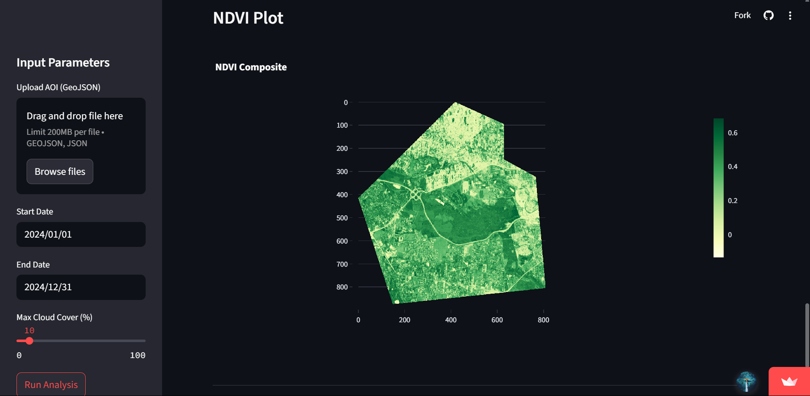

## 🌿 NDVI Explorer

### Overview
This Streamlit application enables users to analyze vegetation health (NDVI) using Sentinel-2 satellite imagery from Microsoft Planetary Computer. Users can define an Area of Interest (AOI) by drawing on a map or uploading a GeoJSON file, then generate NDVI composites and statistics for custom date ranges.



### Key Features
- **Interactive AOI Selection**: Draw polygons directly on the map or upload GeoJSON files
- **Custom Date Ranges**: Analyze vegetation changes over any period
- **Cloud Cover Filtering**: Control maximum acceptable cloud coverage
- **NDVI Calculation**: Automated processing pipeline for vegetation analysis
- **Visualization**: Interactive NDVI heatmaps with statistics
- **Area Validation**: Prevents processing of excessively large areas (>500 km²)

### How It Works
1. Define AOI using map drawing tools or GeoJSON upload
2. Set analysis parameters (date range, cloud cover tolerance)
3. The app:
   - Queries Microsoft Planetary Computer STAC API
   - Filters best available Sentinel-2 scenes
   - Computes maximum NDVI composite
   - Generates visualizations and statistics
   - Displays results in interactive plots

### Requirements
```bash
Python 3.9+
streamlit
streamlit-folium
folium
shapely
geopandas
pystac-client
stackstac
rioxarray
dask
plotly
planetary-computer
```

### Installation
1. Clone repository:
```bash
git clone https://github.com/eugene-tulu/ndvi-explorer.git
cd ndvi-explorer
```

2. Install dependencies:
```bash
pip install -r requirements.txt
```

3. Run the application:
```bash
streamlit run app.py
```

### Usage Guide
1. **Define AOI**:
   - Draw a polygon on the map using drawing tools
   - OR upload a GeoJSON file via sidebar

2. **Set Parameters**:
   - Select start/end dates
   - Adjust cloud cover tolerance (0-100%)
   - Click "Run Analysis"

3. **Interpret Results**:
   - View NDVI statistics (mean, min, max)
   - Examine the NDVI heatmap
   - Check processing logs for details

### Technical Notes
- Uses **Microsoft Planetary Computer STAC API** for satellite imagery
- Processes data using **stackstac** and **xarray**
- Implements cloud-optimized scene selection
- Performs NDVI calculation: `(B08 - B04) / (B08 + B04)`
- Automatically reprojects data to Equal Area projection (EPSG:6933)
- Includes Dask-based parallel processing

### Limitations
- Maximum AOI size: 500 km²
- Requires stable internet connection
- Processing time increases with larger AOIs/longer date ranges

---
Built using Streamlit, Planetary Computer & STAC
